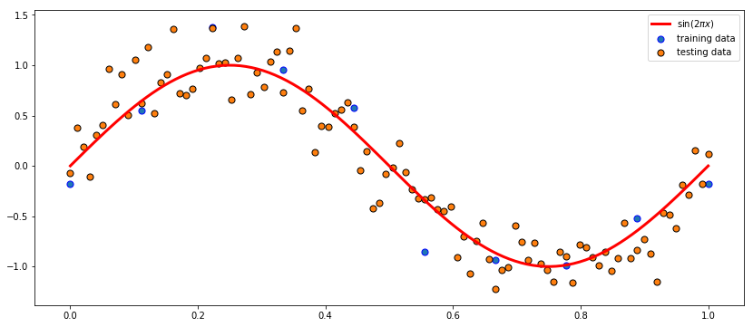
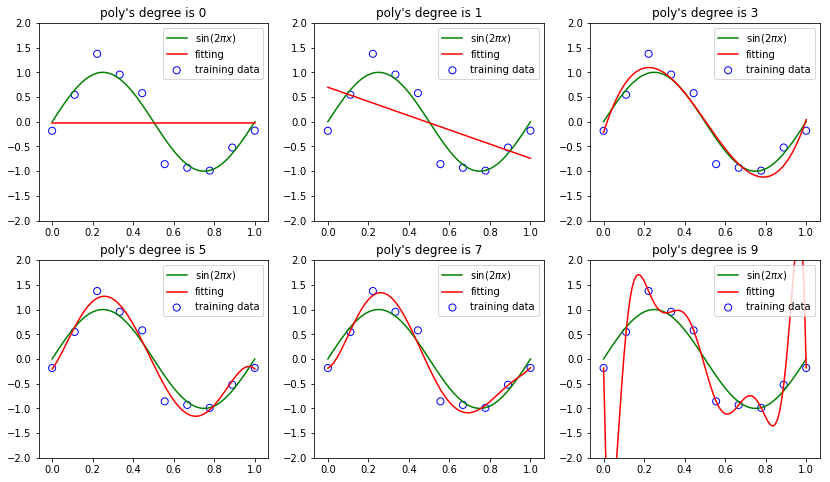
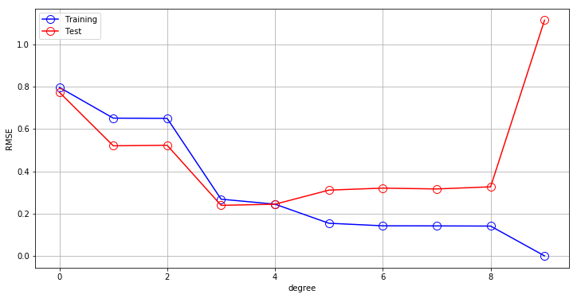
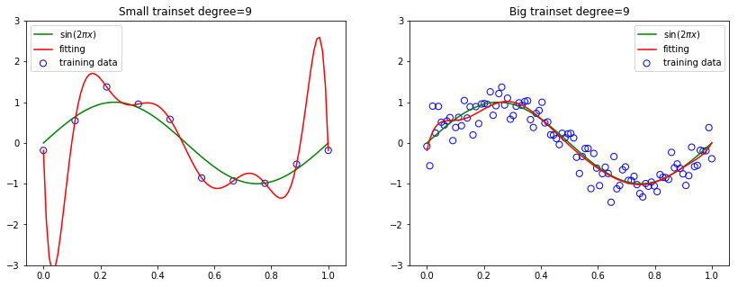

```python
import numpy as np
import matplotlib.pyplot as plt
from sklearn.linear_model import BayesianRidge,LinearRegression,Ridge,ridge_regression
from sklearn.preprocessing import PolynomialFeatures
%matplotlib inline
```

# 1.1多项式拟合

#### 目标数据集的生成方式:
- 首先计算函数sin (2πx) 的对应的值
- 然后给每个点增加一个小的符合高斯分布的随机噪声
- 通过使用这种方式产生数据,它们拥有一个内在的规律,这个规律是我们想要学习的。同时也包含随即噪声，这种噪声可能由随机的过程产生，也可能是由于存在没有被观察到的具有变化性的噪声源。

#### 训练数据和测试数据:
- 训练数据用来训练多项式模型,来学习数据中的规律
- 测试数据,测试模型在新数据上的泛化能力(测试集由100个数据点组成,这100个数据点的生成方式与训练集的生成方式完全相同,但是在目标值中包含的随机噪声的值不同.)


```python
# sin(2*pi*x)
def func(x):
    return np.sin(2 * np.pi * x)

def create_toy_data(func, sample_size, std):
    x = np.linspace(0, 1, sample_size)
    t = func(x) + np.random.normal(scale=std, size=x.shape)
    return x, t
```


```python
x_train, y_train = create_toy_data(func, 10, 0.25)
x_test, y_test = create_toy_data(func, 100, 0.25)
```

### 1.2数据可视化:
- 10 个数据点组成的训练集的图像,用蓝色圆圈标记.
- 100 个数据点组成的测试数据集,用黄色的圆圈标记.
- 红色曲线给出了用来生成数据的sin (2πx) 函数.
- 我们的目标是对于某些新的 x 值,预测 y 的值.


```python
y_r = func(np.linspace(0, 1, 110))
plt.figure(figsize=(14, 6))
plt.scatter(x_train, y_train, edgecolor="b", s=50, label="training data")
plt.scatter(x_test, y_test, edgecolors='k', s=50, label="testing data")
plt.plot(np.linspace(0, 1, 110), y_r, c="r", label="$\sin(2\pi x)$", lw=3.0)
plt.legend()
```


    <matplotlib.legend.Legend at 0x7f253e212b70>





### 1.3 多项式函数拟合

### $$ f(x, w) = w_0 + w_1x + w_2x^2 + ... + w_Mx^M = \sum^{M}_{j=0} w_jx^j $$
- $M$ : 多项式的阶数
- $w$ : 代表系数向量, $ w_0,w_2,w_3,....w_m $

### 1.4 误差函数
- 误差函数衡量了对于任意给定的 $w$ 值,函数 $f(x, w)$ 与训练集数据目标值的差别。
### $$ E(w) = \frac{1}{2} \sum^{N}_{i=1} (f(x_i, w) - y)^2 $$
- $w$ : 系数向量,通过最小化误差函数来确定
- $f(x, w)$ : 从数据中学习得到的函数
- $\frac{1}{2}$ : 系数为了方便计算
- $N$ : 样本的数量

### 1.5 多项式特征
例如，如果输入样本是二维的并且形式为$[a，b]$，则2次多项式特征是$[1，a，b，a^2，ab，b^2]$。
##### sklearn,提供了多项式特征的方法:
```python
from sklearn.preprocessing import PolynomialFeatures

X = np.arange(6).reshape(3, 2)

poly = PolynomialFeatures(2)
poly.fit_transform(X)

>>> array([[ 1.,  0.,  1.,  0.,  0.,  1.],
          [ 1.,  2.,  3.,  4.,  6.,  9.],
          [ 1.,  4.,  5., 16., 20., 25.]])
```

### 1.6 LinearRegression拟合多项式特征


```python
plt.figure(figsize=(14, 8))
for i, degree in enumerate([0, 1, 3, 5, 7, 9]):
    plt.subplot(2, 3, i + 1)
    poly = PolynomialFeatures(degree)
    X_train = poly.fit_transform(x_train.reshape(-1, 1))
    X_test = poly.fit_transform(x_test.reshape(-1, 1))

    model = LinearRegression()
    model.fit(X_train, y_train)
    y_p = model.predict(X_test)

    plt.scatter(x_train, y_train, facecolor="none", edgecolor="b", s=50, label="training data")
    plt.plot(np.linspace(0, 1, 110), y_r, c="g", label="$\sin(2\pi x)$")
    plt.plot(x_test,y_p, c="r", label="fitting")
    plt.ylim(-2, 2)
    plt.annotate("M={}".format(degree), xy=(-0.15, 1))
    plt.title("poly's degree is %d"%degree)
    plt.legend()
```





#### 1.6.1 拟合结果
- ( M = 0 )和一阶( M = 1 )多项式对于数据的拟合效果相当差
- 三阶( M = 3 )多项式似乎给出了对函数sin (2πx) 的最好的拟合
- 当我们达到更高阶的多项式( M = 9 ),我们得到了对于训练数据的一个完美的拟合事实上,$E(w^*) = 0 $。
- 高阶多项式特征虽然完美拟合,然而,但是,拟合的曲线剧烈震荡,就表达函数sin (2πx) 而言表现很差。
- 图四这种行为叫做过拟合( over-fitting )

### 1.7 测试
   测试:通过对新数据的预测情况判断模型($f(x, w)$)的泛化性。
##### 测试的方式为:
-   通过一个额外的测试集,这个测试集由100个数据点组成,这100个数据点的生成方式与训练集的生成方式完全相同,但是在目标值中包含的随机噪声的值不同。我们可以定量考察模型的泛化性与 M(阶数) 的关系,对于每个 M ,计算测试集的 $E(w)$ 。

有时候使用根均方(RMS)误差更方便。这个误差由下式定义:
$$ E_{rms} = \sqrt{\frac{2E(w^*)}{N}} $$

- N : (样本点的数量)以相同的基础对比不同大小的数据集,
- 平方根确保了$E_{rms}$与目标变量$y$使用相同的规模和单位进行度量。


```python
def rmse(a, b):
    return np.sqrt(np.mean(np.square(a - b)))

training_errors = []
test_errors = []
w_params = []

for i in range(10):
    poly = PolynomialFeatures(i)
    X_train = poly.fit_transform(x_train.reshape(-1, 1))
    X_test = poly.fit_transform(x_test.reshape(-1, 1))

    model = LinearRegression()
    model.fit(X_train, y_train)

    y = model.predict(X_test)
    training_errors.append(rmse(model.predict(X_train), y_train))
    test_errors.append(rmse(model.predict(X_test), y_test))
    w_params.append(model.coef_)
plt.figure(figsize=(12, 6))
plt.plot(training_errors, 'o-', mfc="none", mec="b", ms=10, c="b", label="Training")
plt.plot(test_errors, 'o-', mfc="none", mec="r", ms=10, c="r", label="Test")
plt.legend()
plt.grid(True)
plt.xlabel("degree")
plt.ylabel("RMSE")
```


    Text(0, 0.5, 'RMSE')





#### 1.7.1 测试结果
- M(阶数)过大过小都会造成测试误差很大
- 当 M 的取值为 3 ≤ M ≤ 8 时,测试误差较小

### 1.8 不同阶多项式的系数


```python
import pandas as pd

param_df = np.zeros((len(w_params),len(w_params[-1])))

for i in range(len(w_params)):
    param_df[:i+1,i] = w_params[i]

param_df = pd.DataFrame(param_df)
```


```python
param_df
```


<div>
<style scoped>
    .dataframe tbody tr th:only-of-type {
        vertical-align: middle;
    }

    .dataframe tbody tr th {
        vertical-align: top;
    }

    .dataframe thead th {
        text-align: right;
    }
</style>
<table border="1" class="dataframe">
  <thead>
    <tr style="text-align: right;">
      <th></th>
      <th>0</th>
      <th>1</th>
      <th>2</th>
      <th>3</th>
      <th>4</th>
      <th>5</th>
      <th>6</th>
      <th>7</th>
      <th>8</th>
      <th>9</th>
    </tr>
  </thead>
  <tbody>
    <tr>
      <th>0</th>
      <td>0.0</td>
      <td>0.000000</td>
      <td>0.000000</td>
      <td>0.000000</td>
      <td>0.000000</td>
      <td>0.000000</td>
      <td>0.000000</td>
      <td>0.000000</td>
      <td>0.000000</td>
      <td>0.000000</td>
    </tr>
    <tr>
      <th>1</th>
      <td>0.0</td>
      <td>-1.438176</td>
      <td>-0.985530</td>
      <td>12.997090</td>
      <td>17.383902</td>
      <td>5.641664</td>
      <td>-0.256404</td>
      <td>1.924420</td>
      <td>-4.560926</td>
      <td>-215.451195</td>
    </tr>
    <tr>
      <th>2</th>
      <td>0.0</td>
      <td>0.000000</td>
      <td>-0.452646</td>
      <td>-37.304887</td>
      <td>-59.458286</td>
      <td>38.420548</td>
      <td>111.186592</td>
      <td>75.201286</td>
      <td>205.987591</td>
      <td>5077.185412</td>
    </tr>
    <tr>
      <th>3</th>
      <td>0.0</td>
      <td>0.000000</td>
      <td>0.000000</td>
      <td>24.568161</td>
      <td>60.101335</td>
      <td>-216.569502</td>
      <td>-529.761376</td>
      <td>-316.364404</td>
      <td>-1302.830510</td>
      <td>-45179.500599</td>
    </tr>
    <tr>
      <th>4</th>
      <td>0.0</td>
      <td>0.000000</td>
      <td>0.000000</td>
      <td>0.000000</td>
      <td>-17.766587</td>
      <td>299.360835</td>
      <td>904.596578</td>
      <td>301.203617</td>
      <td>4022.592501</td>
      <td>210149.339158</td>
    </tr>
    <tr>
      <th>5</th>
      <td>0.0</td>
      <td>0.000000</td>
      <td>0.000000</td>
      <td>0.000000</td>
      <td>0.000000</td>
      <td>-126.850969</td>
      <td>-665.218737</td>
      <td>214.704064</td>
      <td>-7532.869930</td>
      <td>-569098.691158</td>
    </tr>
    <tr>
      <th>6</th>
      <td>0.0</td>
      <td>0.000000</td>
      <td>0.000000</td>
      <td>0.000000</td>
      <td>0.000000</td>
      <td>0.000000</td>
      <td>179.455923</td>
      <td>-459.109693</td>
      <td>8579.726633</td>
      <td>928109.751580</td>
    </tr>
    <tr>
      <th>7</th>
      <td>0.0</td>
      <td>0.000000</td>
      <td>0.000000</td>
      <td>0.000000</td>
      <td>0.000000</td>
      <td>0.000000</td>
      <td>0.000000</td>
      <td>182.447319</td>
      <td>-5351.534105</td>
      <td>-897238.544636</td>
    </tr>
    <tr>
      <th>8</th>
      <td>0.0</td>
      <td>0.000000</td>
      <td>0.000000</td>
      <td>0.000000</td>
      <td>0.000000</td>
      <td>0.000000</td>
      <td>0.000000</td>
      <td>0.000000</td>
      <td>1383.495356</td>
      <td>473256.605051</td>
    </tr>
    <tr>
      <th>9</th>
      <td>0.0</td>
      <td>0.000000</td>
      <td>0.000000</td>
      <td>0.000000</td>
      <td>0.000000</td>
      <td>0.000000</td>
      <td>0.000000</td>
      <td>0.000000</td>
      <td>0.000000</td>
      <td>-104860.691043</td>
    </tr>
  </tbody>
</table>
</div>


系数分析:

- 对于 M = 9,训练集的误差为0,此时的多项式函数有10个自由度,对应于10个系数$w_0,...w_9$,所以可以调节模型的参数,使得模型与训练集中的10个数据点精确匹配。 
- 因为高阶多项式包含了所有低阶的多项式函数作为特殊情况。 M = 9 的多项式因此能够产生至少与 M = 3 一样好的结果。
- 随着 M 的增大,系数的大小通常会变大。对于 M = 9 的多项式,通过调节系数,让系数取相当大的正数或者负数,多项式函数可以精确地与数据匹配,但是对于数据之间的点(尤其是临近区间端点处的点),函数表现出剧烈的震荡。直觉上讲,发生了这样的事情:有着更大的 M 值的更灵活的多项式被过分地调参,使得多项式被调节成了与目标值的随机噪声相符。

### 1.9 曾加训练数据的数量
- 给定同样的阶数(即模型的复杂度)
- 对比在相同阶数和测试数据下,不同规模数据上模型的情况


```python
#增加到100个数据点.
new_x ,new_y = create_toy_data(func,100, 0.25)
```


```python
poly = PolynomialFeatures(9)
train_x = poly.fit_transform(x_train.reshape(-1, 1))
test_x = poly.fit_transform(x_test.reshape(-1, 1))
model = LinearRegression()
model.fit(train_x, y_train)
test_y = model.predict(test_x)
#-------------------
x_new = poly.fit_transform(new_x.reshape(-1, 1))
model = LinearRegression()
model.fit(x_new, new_y)
test_y2 = model.predict(test_x)

plt.figure(figsize=(14, 5))
plt.subplot(1, 2, 1)
plt.scatter(x_train, y_train, facecolor="none", edgecolor="b", s=50, label="training data")
plt.plot(np.linspace(0, 1, 110), y_r, c="g", label="$\sin(2\pi x)$")
plt.plot(x_test,y_p, c="r", label="fitting")
plt.title("Small trainset degree=9")
plt.ylim(-3, 3)
plt.legend()

plt.subplot(1, 2, 2)
plt.scatter(new_x, new_y, facecolor="none", edgecolor="b", s=50, label="training data")
plt.plot(np.linspace(0, 1, 110), y_r, c="g", label="$\sin(2\pi x)$")
plt.plot(x_test, test_y2, c="r", label="fitting")
plt.title("Big trainset degree=9")
plt.ylim(-3, 3)
plt.legend()
```


    <matplotlib.legend.Legend at 0x7f25329995c0>





### 1.9.1结果分析
- 给定的模型复杂度,当数据集的规模增加时,过拟合问题减弱
- 数据集规模越大,我们能够用来拟合数据的模型就越复杂(即越灵活)
- 数据点的数量不应该小于模型的可调节参数的数量的若干倍(比如5或10)
- 因此,我们需要根据训练数据的规模来限制模型的复杂度(即参数的数量),根据待解决的问题的复杂性来选择模型的复杂性

### 1.10 正则化(regularization)
- 正则化是一种控制过拟合现象的技术(即可以在不限制模型复杂度的情况下,降低过拟合)
- 一般给误差函数增加一个惩罚项,使得系数不会达到很大的值(减小系数的值)

##### 增加L2正则项后的误差函数
$$ E^~(w) = \frac{1}{2} \sum^{N}_{i=1} (f(x, w) - y)^2 + \frac{\lambda}{2}\parallel w^2 \parallel $$
- $\parallel w^2 \parallel = w^{2}_0 + w^{2}_1 + w^{2}_2 + .... w^{2}_M $
- $\lambda$ : 控制正则化的程度,$\lambda$越大,$w$的值越小.
- 注意,通常系数$w_0$从正则化项中省略

### 1.10.1 尝试不同的正则化 $\lambda$
- 仍使用10个数据点的数据集
- 在M(阶数)=9的情况下,尝试不同的正则化系数


```python

```


```python

```
